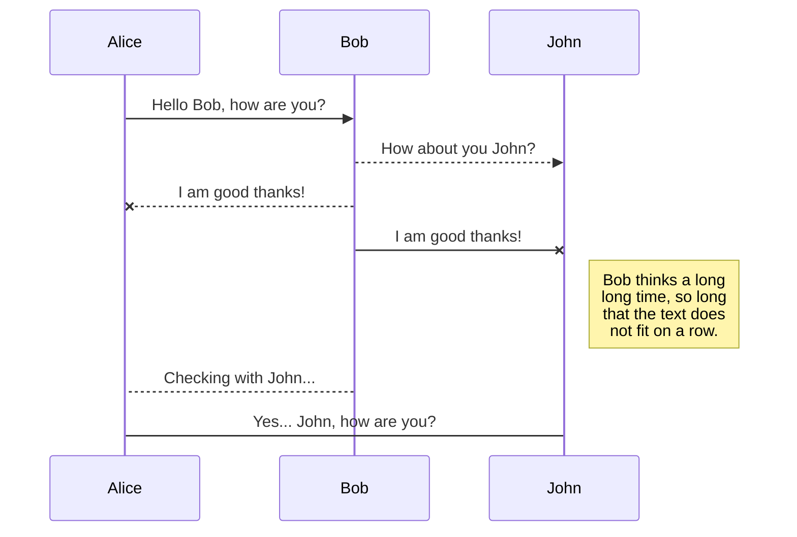
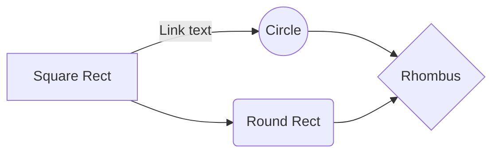

# ZenKey Documentation Site

This project was built using [Docusaurus 2](https://docusaurus.io/).

## Setup

### Installation
```
$ npm install
```

### Local Development
```
$ npm start
```
This command starts a local development server and opens up a browser window. Most changes are reflected live without having to restart the server. Sometimes a refresh is needed to rebuild documentation hierarchy.

### Build
```
$ npm build
```
This command generates static content into the `build` directory and can be served using any static contents hosting service. We are using GitLab pages in the meantime.

### Docker Build

Building and viewing in Docker allows search to work.

```
npm build
docker build -t my-apache2 .
docker run -dit --name Docusaurus -p 8080:80 my-apache2
```

Open http://localhost:8080/ in your browser.

## Supported Markdown

In addition to regular markdown, the following can be used for emphasis.

### SmartyPants
SmartyPants is used to convert ASCII punctuation characters into "smart" typographic punctuation HTML entities. For example:
| |ASCII |HTML |
|----------------|-------------------------------|-----------------------------|
|Single backticks|`'Isn't this fun?'` |'Isn't this fun?' |
|Quotes |`"Isn't this fun?"` |"Isn't this fun?" |
|Dashes |`-- is en-dash, --- is em-dash`|-- is en-dash, --- is em-dash|

### UML diagrams

We use [Mermaid](https://mermaidjs.github.io/) to render UML diagrams. For example, this will produce a sequence diagram:

And this will produce a flow chart:


### Code Highlighting

Code highlighting is done via [PrismJS](https://github.com/FormidableLabs/prism-react-renderer). The default supported languages can be found [here](https://github.com/FormidableLabs/prism-react-renderer/blob/master/src/vendor/prism/includeLangs.js).

Light mode syntax coloring is small text WCAG AA compliant and large text WCAG AAA compliant . Dark mode is WCAG AAA compliant for both large and small text.