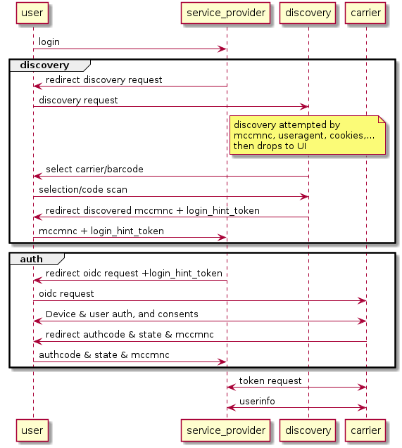

# MODRNA-based Discovery Flow

This discovery process for ZenKey uses OpenID Connect MODRNA (**M**obile **O**perator **D**iscovery, **R**egistration & Authe**N**tic**A**tion) extensions. More information on MODRNA can be found [here](https://openid.net/wg/mobile/).

In this model, Service Providers make two distinct requests. The first is for discovery and the second is to the identified carrier for the authorization code.

The following is a high-level sequence diagram illustrating this flow. `service_provider` refers to the Service Provider.

## How It Works

This model has two discovery endpoints:
1. A user experience endpoint using a browser client (or native client that can open a browser tab).
2. An API endpoint that returns the correct carrier's OIDC configuration. 

### Carrier Discovery UI
`https://discoveryui.myzenkey.com/ui/discovery-ui` 
  * Redirecting to this endpoint navigates to choosing your carrier UI
      -Required url parameters include `client_id` and `redirect_uri`
      -Optional url parameters include `state`, `sdk_version` and `prompt`
  * When the user selects their carrier, they're redirected to their `redirect_uri`
      -The response has url parameters `mccmnc`, `state` and `login_hint_token` (for secondary devices)

### OIDC Discovery Issuer 
`https://discoveryissuer.myzenkey.com/.well-known/openid_configuration`
  * A GET request to this endpoint returns the OpenID configuration document
      -Required url parameters include `client_id` and `mccmnc`
      -Optional url parameters include `sub`, `phone_number` and `ip`
  * The response is JSON with OpenID configurations including `issuer`, `authorization_endpoint`, `token_endpoint` and `user_endpoint`

### Request Auth Code from `authorization_endpoint`
  * Redirecting to this endpoint navigates to the carrier specific `authorization_endpoint`
      -The required url parameters include `client_id`, `redirect_uri`, `response_type`, `scope` and `state`
      -The `response_type`=code for ZenKey purposes
      -The optional url parameters include `login_hint_token` (for secondary devices)
  * When authorization request is received the user is redirected to their `redirect_uri`
  
The response has url parameters `code`, `state`, `mccmnc`, `correlation_id`, `error`, and `error_description`.

See also [Optimized Discovery Flow](optimized-discovery-flow.md).
