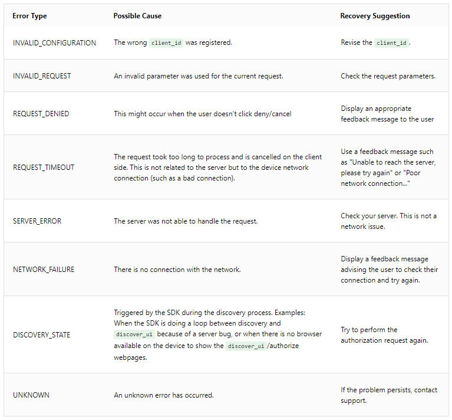

# Troubleshooting Authorization Errors on Android

Error Type identifies the class of `AuthorizationError`. For more details, refer to the `ERROR_KEY` and `ERROR_DESCRIPTION_KEY`. 
 
The following table summarizes the `AuthorizationError` error types and potential recovery suggestions for each.

