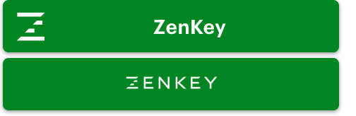
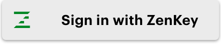
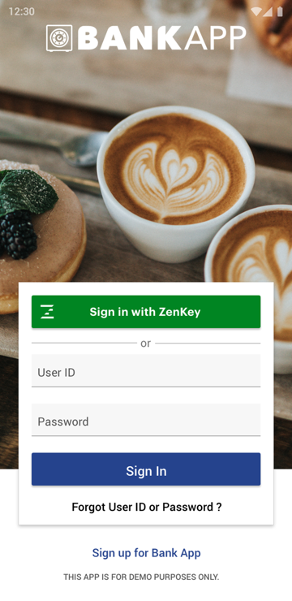
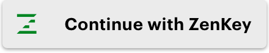
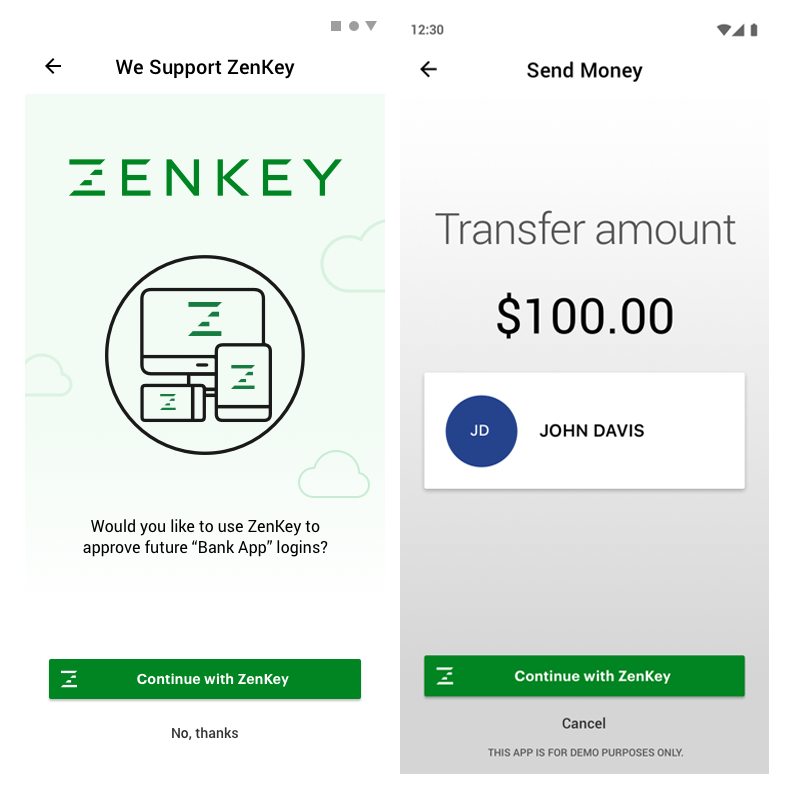
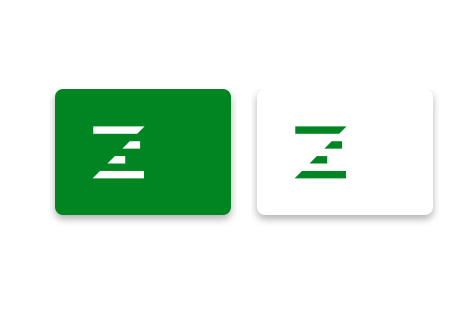
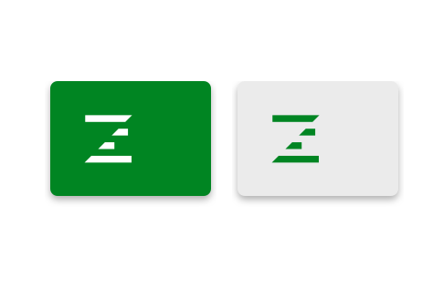
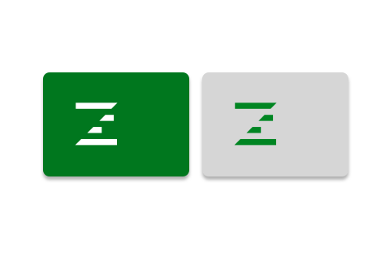
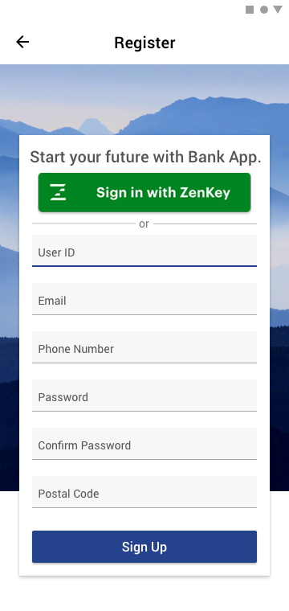

# ZenKey Buttons

## Default Button Options
ZenKey buttons used to make a sign in request:
 
Sign in with ZenKey 

Continue with ZenKey 

Large ZenKey only button

Micro ZenKey logo only

ZenKey recommends using the button we provided in our SDKs or samples.

**Warning:** If you are interested in creating a custom ZenKey button, please contact your ZenKey representative.

When you include these buttons in your design there are best practices to follow:

  * States — the button’s mode, such as whether it has just been tapped.
  * Color — the button’s color, such as whether it is green or white.
  * Text — the button’s call to action, such as a sign-up, login, or authorization.
  * Size — the button’s size, such as a micro button on a smaller screen.
  * Placement — the button’s location, such as high and centered on a sign-in screen.

Keeping these practices in mind will help you create the optimal experience each time a user interacts with the ZenKey button. For more details about each one, read the sections below.

## Button States
 
ZenKey buttons may be shown in one of four states:

  * Enabled — communicates an interactive button.
  * Focused — communicates when users have highlighted the button.
  * Disabled — communicates a non-interactive button.
  * Pressed — communicates a user tap.

These states are expressed in both the color and white versions of the ZenKey button.
 
Enabled
 

Focused

Pressed  

Disabled

## Button Color
 
ZenKey buttons use three main colors depending on the background color and button's state:

  * Green (`#008522`) — serves as the primary color; best white or light backgrounds.
  * White (`#FFFFFF`) — serves as the secondary color; use only on dark backgrounds or in dark mode.
  * Gray — serves to indicate inactive buttons only, such as a pressed or disabled state.

Use the color version of the button on white or light backgrounds. Use the light button variation on dark backgrounds and in dark mode. While you may resize your ZenKey buttons as needed, you may only use the colors of the ZenKey design assets shown here.

## Button Text

Center the ZenKey button text between the ZenKey symbol and the right edge. When using the ZenKey name, always use the camel case (i.e. “ZenKey” not “Zenkey”).

For the call to action itself, consider the intent of the ZenKey user and whether they are a new or registered customer of your service. When signing in new or registered members to your service, “Sign in with ZenKey” is the most appropriate call to action.

In some cases, use “Continue with ZenKey” for your ZenKey button text.

Enabled:

Focused:

Pressed:

Disabled:

Typically, this call to action is best for gaining users' approval, such as when they intend to use ZenKey to approve future logins or authorize transactions. In either instance, users first confirm their intent to proceed.

## Button Size

Use micro buttons when space is limited. Because the button does not contain a call to action, the user interface must make the button's function clear. Make the padding of labels on buttons 16dp.

Enabled

Focused

Pressed

Disabled

## Placement
To emphasize ZenKey as a sign-in option, prioritize the ZenKey button on your application’s login screen. This may mean placing the ZenKey button above the form fields users would fill in during registration or making the button more prominent. There must be at least 8dp of space between your button and any other touch targets.

* More information available at [GitHub}(https://github.com/MyZenKey)
