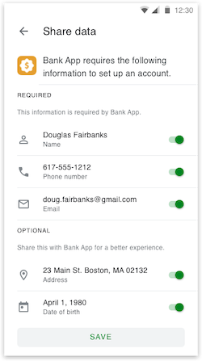

# Capturing and Managing User Information

Users may edit, approve, or deny scopes you request. The scopes the user does consent to share with you will only be made available once you have used your access token to issue a GET request from your backend to the carrier's `userinfo_endpoint` and the carrier provides this information in the userinfo response. 
```
GET /userinfo HTTP/1.1
nContent-Type: application json
Authorization: Bearer {ACCESS_TOKEN} 
nx-authorization: {<key_binding>}
```
 
## Types of Scopes

Besides openid, all scopes are optional. Below is a list of all scopes supported by ZenKey:
 
  * openid
  * name
  * email
  * address
  * phone
  * postalCode
  
By default, authorization requests made with the ZenKey SDK include the `openid scope`, which returns an `id_token` from the `token_endpoint`. To use additional scopes, set them on the button and they will be added to the request. 

For more information, refer to the following guides: 

  * [Set scopes for user information on Android](../../android/integration-guide/android-set-scopes-for-user-information.md)
  <!-- * [Set scopes for user information on iOS](../../for-ios-dev/ios-set-scopes-for-user-information)  -->
  * [Integration options on the web](../../web/web-integration-options) 

## What Gets Collected?

ZenKey users are always in control of their personal data. While you define what type of information to collect, users must consent to share that information with you.

What if a user declines to share required attributes?

If a user declines to share attributes that are required by your application, they receive a warning dialog and are allowed to enter that information in your application later. For example, not sharing a required scope such as postal code triggers a dialog to advise them to confirm the action and that your app may require this information at a future date. 
 
### Retrieving User Information

To retrieve user information, clients must present a valid access token. The destination for this call is indicated by the `userinfo_endpoint` extracted from the discovered carrier’s openid-configuration. Only those claims scoped by the token will be made available to the client. Since this user info is stored with the carrier, the carrier delivers that information via the user info response.
 
```
{   “sub”:”mccmnc-1234567abcdefghijk”,
    “name”: {
        “value”:”Jane Doe”,
        “given_name”: “Jane”,
        “family_name”: “Doe”},
    “email”: {
        “value": “janedoe@example.com”},
    “postal_code”: {
        “value”:“90210”},
    “phone”: {
        “value”:“+13101234567”},  
}
```

## Authorization User Experience

To complete the authorization flow, users must first download their mobile carrier's ZenKey app and set up a ZenKey account on their device. They can then add and authorize your service within the ZenKey app. After app installation and account creation, the user encounters the:
 
Launch; Sign-in | Consent screen (to provide authorization)
 
Confirm | Success screen (before successfully logging in to your app) 
 
**1. Launch Screen**
When users open your app, your Launch Screen includes the "Sign in with ZenKey" button. 


**2. Consent Screen | Sign-In Screen**
If a user attempts to select the "Sign in with ZenKey" button on a primary or secondary device without an installed ZenKey app and active account, a device check redirects them to download the ZenKey app suited for their mobile platform and wireless network.

Once the ZenKey app is installed and the account created, users enable your service in ZenKey and review the scopes your app is requesting (if any).

Active ZenKey users who have not enabled your app are asked to "Agree" on the ZenKey consent screen to enable your app as a service. Here, users review the requested scopes and approve or deny the authorization request.

Those who downloaded ZenKey, created a ZenKey account, and enabled your service in the ZenKey app will see three options:
 
Edit - users may toggle required and optional scopes on or off in the ZenKey app. Users who choose to edit scopes in the ZenKey app can then return to the authorization flow where they may "Sign in" or "Deny" consent. If new scopes are requested, the user may see "Review and Edit" instead of "Edit."
 
  * Agree - users may agree to share all attributes and proceed to sign in to your application.
  * Deny - users may deny sharing information and cancel authorization altogether.


**3. Confirm | Success Screen**
This screen refers to your app's UI/UX. For users authorizing transactions such as a money transfers, ZenKey does not provide a screen outlining the details of the transaction in the ZenKey app. However,  users may review the details of their transactions such as the amount being sent and the name of the recipient, and then select the "Continue with ZenKey" button if you added it to your app's design, or they may cancel the request.


**Note:** Users may need to provide their ZenKey PIN or Biometric authorization (e.g., fingerprint or face scan), if set up in the app, depending on the level of authentication required.


If the user confirms the transaction, you may then load a success screen to indicate the completed money transfer.


 
## Handling Issues of Non-Consent or Changes

For best practices, your application should either ask users for the scopes above or not require them at all. Moreover, keep in mind that users who select "Edit" during authorization can see a list of required and optional scopes. In other words, if you specify a user's email, name, and phone as required scopes, but define postalCode as optional, users can view these differences in ZenKey's 'Account Details' page after they click "Edit" on the authorization screen.
 
## Account Linking

Account linking refers to associating a user’s ZenKey account with the account they created with your service. For account linking to work, several criteria must be met:
 
Users must have an account with your service and log in. If users have ZenKey accounts set up, they must first log in to your app or website before they can link their ZenKey account. Your service must first authenticate the subscriber — likely via a username and password — before allowing the user to link their existing ZenKey account. If users do not yet have an account with your service, they must create one. For users who have just created an account with your service and have already created a ZenKey account, we advise notifying the user that ZenKey is now supported so they can complete the linking flow. (Note: the images below are solely for demonstration purposes. Please refer to our ZenKey Brand Guidelines documentation for more specific instructions on how to display the ZenKey name, logo, and button.)
 


Users must have a ZenKey account on their device set up. Even users created an account with your service, in order to link accounts, they must have created a ZenKey account as well. If users do not have accounts, ZenKey will attempt to detect the carrier associated with the device and prompt users to download the ZenKey app for that carrier. 
 
Users must enable your service in the ZenKey app. To link accounts, ZenKey checks to see if your service has been enabled. If so, users will select “Sign In”. If not, users must agree to share data or edit their details.
 
Users must authorize your app. After registering accounts for your service and ZenKey, users then click the “Sign in with ZenKey” button and "Agree" to share information. During this step, users may also choose to edit which profile details they wish to share within the ZenKey app. 



### Matching a User's Subject Identifier (sub)

Assuming the above criteria are met, you may now attempt to match users' ZenKey account with the account they created for your service. This reconciliation process occurs on your backend, specifically by your server looking up a users' sub-identifier — the main pairwise identifier that associates a single user with your unique client_id — whose value gets returned along with the Access/ID Token and later by the userinfo_endpoint.
 
 
**Note:** The Sub ID may contain numbers, letters, and other characters.

### Users with Multiple Accounts

In the event users have multiple accounts with your service, you may also choose to look up their email address (if available) and link it to the relevant account. Another option is to prompt users to name which of their accounts with your service they linked to their ZenKey account. Users may proceed to their accounts or opt to create new accounts with your service.

In rare cases, you may not be able to match users' sub-identifier, most likely because users have migrated accounts (i.e., switched carriers). So while a user's sub-identifier normally stays constant, its value is modified if the user migrated carriers.

For any users who migrated accounts, be sure to update that user's old sub value with the new sub value provided by their new carrier. If you do not update these references on your backend, you will be unable to link accounts.

### Account Linking User Experience
With the account linking flow completed, users may click on ZenKey instead of using their username and password for all future sign-ins. After a user authorizes your app with the ZenKey button, your job is to find out whether this ZenKey account is linked to an account in your user database. If your backend does not find a matching account, or finds several, the app must prompt the user to login at this point. As stated above, you might do a lookup based on the sub and/or email address (if available) to resolve this. Users should not have to link their accounts themselves. The task of linking accounts is yours after authorization.