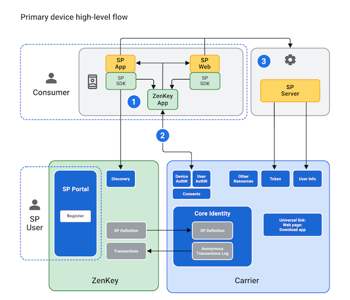

# Enrolling New Users

Before users can sign in to your app using ZenKey, they must first install their carrier’s version of the ZenKey app on their primary device. After completing the initial setup, they may use ZenKey to log in to third-party applications. 

Pressing the ZenKey button in a third-party app or website from their primary device starts the authentication process. This prompts the user to set up their device as the primary device if they have yet to do so.

**Note:** This primary device is also the device with which users can authenticate requests from other devices, such as desktop browsers and tablets.

The user enrolls with ZenKey on his/her mobile phone as the primary device for accessing your application.

1. The user's wireless carrier is determined by the mccmnc — a six-digit number representing the user’s mobile country code (mcc) and mobile network code (mnc) — whose value allows for SIM and user authentication. The carrier returns an authorization code via your Redirect URI.
1. Your app or website makes an authorization code request to the local ZenKey app.
1. If the user consents to share information, your backend server issues a token request for user info and other resources.