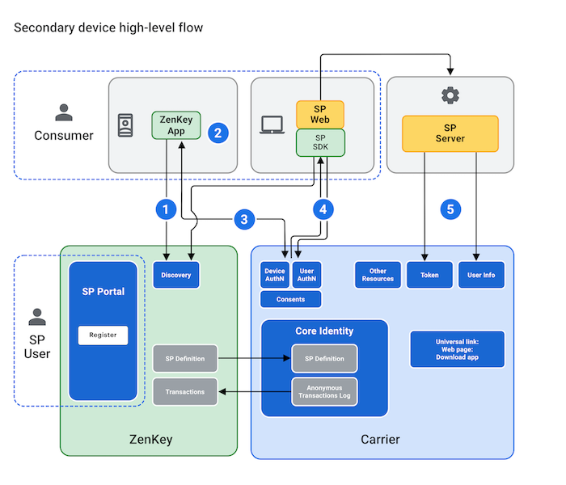

# Registering Trusted Devices

Trusted devices/browsers can be registered using secondary flow.

## Register Trusted Device/Browsers through Secondary Flow 

Users can also use ZenKey to authenticate on devices other than a primary device, such as a tablet. These secondary devices rely on users to complete the authentication process. Users pressing the ZenKey button on secondary devices see a visual and numeric code as a part of the secondary device authorization process. This code allows users to associate that secondary device with their primary device.

1. The SDK presents the carrier Discovery UI. If users authorize secondary devices from an app on a desktop browser, a web view will be used for this step.
1. Users then scan the visual codes or enter the numeric codes into the ZenKey app on their primary device.
1. Once users approve the request in the ZenKey app on their primary devices, the carrier Discovery UI returns a login_hint_token to your app’s Redirect URI. This login_hint_token is only returned to a secondary device for use during the authentication request.
1. To perform SIM and user authentication, your app makes an authorization code request to the appropriate carrier and receives the auth code in its Redirect URI.
1.  If users consent to share information, your backend server issues a token request for user info and other resources.