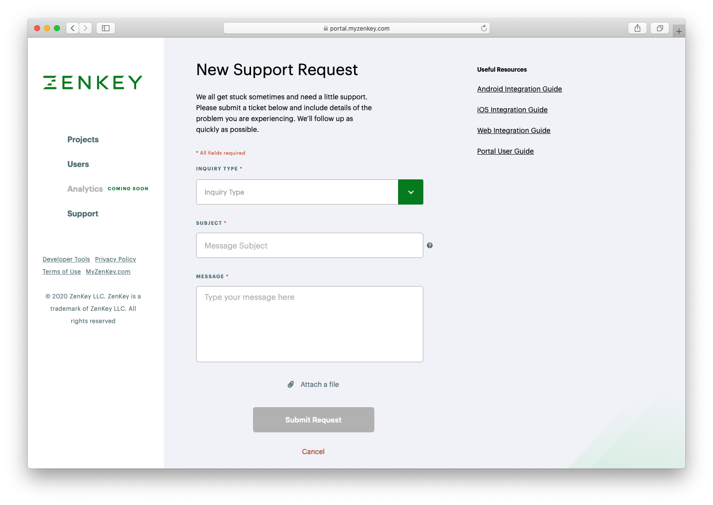

# Contact portal support

Completing registration of individual accounts in the ZenKey portal grants access to the support link on the left side of the screen. If you have any type of question or help request, contact ZenKey.

Select an inquiry type, add a subject, and describe your question or issue. You may attach files such as screenshots or other helpful supporting materials. 

For technical issues, please provide all relevant details including: 

- Steps to reproduce
- Debug logs or error printouts
- Warnings or error messages observed
- ZenKey SDK version number(s) involved
- Carrier(s) involved  
- ZenKey mobile app version number(s) involved
- Device type(s) and model(s) involved
- Device software platform(s) and version number(s) involved
- All client IDs involved

You will receive an automated confirmation email with your ticket number and a representative will contact you.