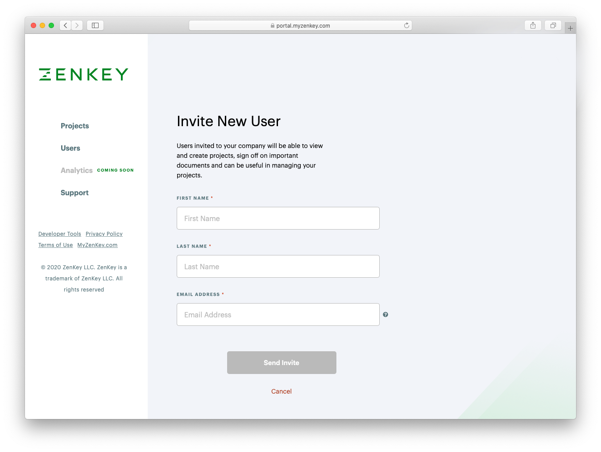

# Invite collaborators

Once your company is approved and active in the ZenKey portal, you may invite other coworkers to join you. Acceptance of contract agreements is unnecessary to being inviting others. 

Click **Users** on the left side of the portal screen, then provide the name and email address of the new user on the user management page. ZenKey sends invitation emails to invitees.

Invitees register using the link in the email. Invitees must provide their company roles and phone numbers and agree to the terms of use and portal privacy policy. Users cannot change the name or email on the invitation.

Once invitees complete the registration process--including email verification--they can sign in and join their company’s portal account. Companies receive an email notification when invitees register.

Visit the user management page to view the users associated with your company account.