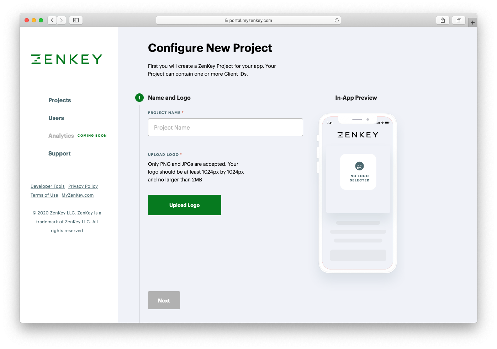

# Project name and logo

Project names are how apps or services appear in the ZenKey app experience. Project names also describe apps or services in the ZenKey directory.

Project names and logos are automatically applied to all clients within the project. 

Confirm your logo's appearance in the preview prior to its inclusion in the integrated ZenKey experience.

## Logo Requirements
Your logo must meet the following requirements: 
 - JPG or PNG format
 - At least 1024 by 1024 pixels
 - Square shape
 - No transparent backgrounds

