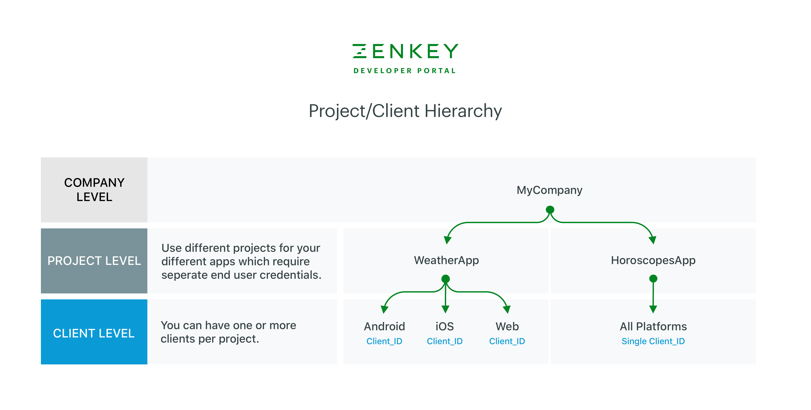

# Set up project

After approval and acceptance of the limited trial agreement, your company is ready to tackle its first project.

Click **Start My First Project** or **Configure a New Project**, depending on what screen you’re viewing.

## ZenKey Project/Client hierarchy

A ZenKey project represents your app. You may choose to set up one client or multiple clients as part of your project. Some developers prefer to have a different client for each platform (Android, iOS, web), while others choose to use different clients for different versions of their app.

End-users won't know if you used different ZenKey clients for different app platforms or versions. They consent once and then use ZenKey across your clients/platforms/versions related to a single project.

Some of the items to configure below are set at the project level and are shared across clients within that project. This includes the app name, logo, your terms of service, and your privacy policy.

The following diagram illustrates how to set up two different apps within a company - one app for weather and another for horoscopes.

  * The apps serve different projects.
  * The projects have different names.
  * The projects appear separately in the ZenKey Directory**.
  * End-users provide consent to each app/project to use ZenKey with that app.
  * Each ZenKey client has a unique Client ID and Client Secret.

Some ways to set up your Project/Client hierarchy

