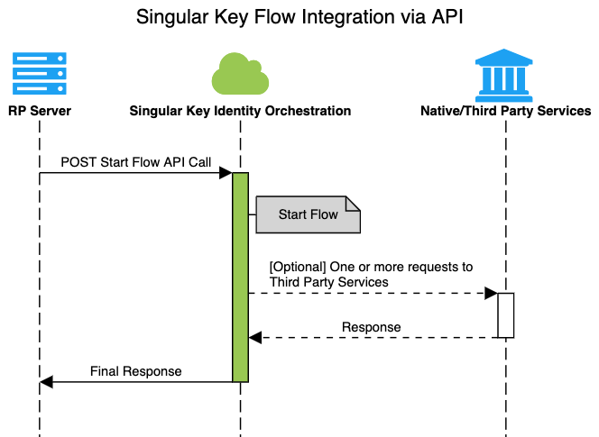
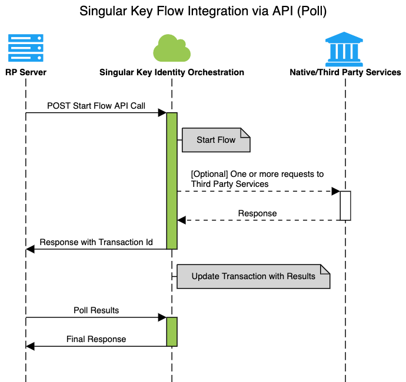
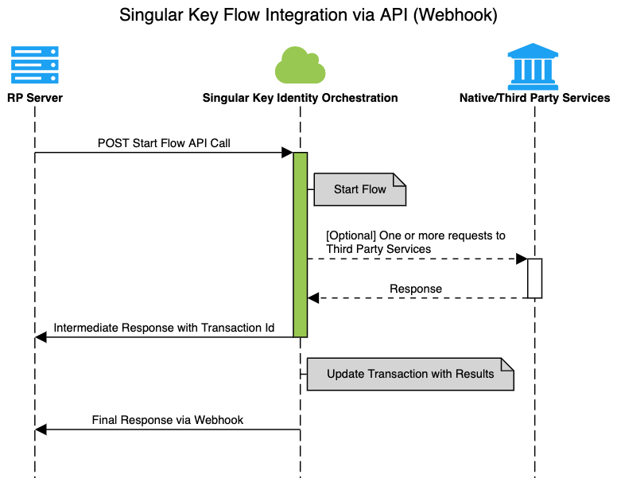

---
sidenav:
---

# Singular Key Flow Integration via API

## Getting Started

There are several ways to invoke a Singular Key Flow - using OIDC, SAML, Web SDK (Widget), Native Mobile SDK or API.

This article documents Flow invocation via an API call. We will first create a simple flow in Flow Studio in Singular Key Admin Portal.


## Terminology

* **Connector**: A virtual representation of a third party service or a native Singular Key functionality within the Singular Key Orchestration Platform. It exposes a set of **capabilities** that can be used in flows
* **Connection**: A configured instance of a **connector**
* **Flow**: Connections can be connected to each other to create meaningful user journeys or flows

## Creating a Flow
We'll create a Hello World Flow, which when invoked will send a JSON response back.

In order to create a flow, you will need access to the Singular Key Admin Portal. At a high level, you need to:
* Register an account in the [ZenKey developer portal](https://portal.myzenkey.com/)
* Create and configure **connections**
* Create a **Flow** in Flow Studio 
* Create an **App** and assign a Flow to it.

We'll walk you through the steps to create your first flow (Helloworld)

### Step 1: Log into Singular Key Admin Portal
Use the Admin Portal URL that is provided to you during the onboarding-process. Login with the credentials provided to you

### Step 2: Create Connection(s)
We'll create a Http Connection (which has the capability to send a JSON response)
* Http Connection
    *  Click on Connections
    *  Click on 'New Connection' button
    *  Choose 'Http' Connectot from the dropdown list
    *  Click Create 
You should now see a 'Http' connection in your Connections list

### Step 3: Create Flow

* Click on **Flow Studio**
* Click on '**Create New Flow**'
* Enter **Name of Flow** and click 'Create'.
    * A new flow is created and you'll be presented with a Flow Canvas
* On the **Flow Canvas**, click on the + icon on the bottom left corner to '**add connection**'.
* On the Add Connection menu, select the 'Http' Connection. This will automatically place the Http connection on the Flow Canvas.
* Click on the **Http Connection** that is on the canvas. It'll present you with a list of supported capabilities for this connection. 
* Choose the '**Send Success JSON Response**' capability and click Save.
    * [Optional] In the 'Send Success JSON Response' capability, you can optionally configure a couple of parameters
        * `Return Request Parameters?`: If you want to the request fields to be sent back in the response, you can leave this option selected.
        * `Additional Fields in the Response`: You can add several custom fields to the response. These could be hard coded values or static values or dynamically computed values from the output of any previous node in the flow. 
* Click on the 'Save' button on the Canvas to **Save and Deploy** the flow


You have **successfully created your first flow**!
In the future iterations, we will add several nodes before the Http 'Send Success JSON Response' to send more meaningful responses. The idea is that several nodes can be strung together in many different ways to create a complex set of 'if these then those' sequences. 

[`Real World Flow`] For example, a customer IVR could invoke a Singular Key flow when a user makes a call to a customer's help desk. The flow request can contain the caller's phone number and user's CRM data in the customer's data. The flow can look up the user's phone number against a mobile identity provider to check for Sim-Swap fraud and check user's mobile identity trust score by comparing the user's information from the input with the information from the carrier's database. 'Function' nodes can then determine whether the user is trust worthy or a step up is needed to verify the user's identity. 

#### [Optional] Define Input Schema
In order to send input parameters in the body of the flow invocation REST API call, you will need to define an input schema for the flow. On the flow canvas, click on the three-dot veritcal menu on the top right corner and select `Input Schema`. You can then define one or more input fields and their data type.

After defining an input schema, the input parameters is available in any text field by clicking on the parameters `{}` button and selecting global->parameters.  Optionally, you can type the following in any input field of any node `{{global.parameters.<inputParameterName>}}`. Example `{{global.parameters.phoneNumber}}`


### Step 4: Create App and Assign Flow to App
* Click on Applications on the left menu
* Click on 'Create New App' button
* Enter app name ('Helloworld') and click create. You will now see the newly created app in the list
* Select the newly created app. You will be presented a settings dialog box which contains several tabs. 
    * Take a note of the 'CompanyId' and API Key in the General Tab. You will need them to invoke the flow in the later section
* Click on the Flows Tab
    * Select the flow from the 'Add Flow' drop down box
    * Click on Apply 
    * Take note of the FlowId. 
    * 
## Invoking a Flow via REST API Call

### API Endpoint

API_ENDPOINT

**Sandbox**: https://devapi.singularkey.com
**Production**: https://api.singularkey.com

### REST API Call

```bash    
curl POST 'API_ENDPOINT/v1/company/:companyId/flows/:flowId/start' \
--header 'Content-Type: application/json' \
--header 'X-SK-API-KEY: YOUR-API-KEY' \
--data-raw '{
  
}'
```
### Authentication

REST API calls need to include **x-sk-api-key** parameter in the header of the request. The api key is specific to an 'application' in the Singular Key Admin Portal. In the portal, click on Applications-> your specific application-> General Tab to find the **Api Key**.


### Request Parameters
* [Required] `companyId`: Singular Key Generated Unique Id for your account
* [Required] `flowId`: Singular Key Generated Unique Id for your flow
* [Required] `X-SK-API-KEY`: The value of this field in the header is the api key for the Singular Key App associated with the flow
* [Optional]  `Body`: You may send a JSON formatted body. All the fields in the body are available to any connection in the Flow Canvas as input. 
    For example, you may send a phone number, which can be used by a connection that supports mobile risk lookup. The output from that *mobile risk look up connection* can then be linked to the *http connector* which can provide you the final results in a response


### Responses

#### Success Response Fields
* `interactionId`: Singular Key Generated Unique transaction Id
* `companyId`: Singular Key Generated Unique Id for your account
* `flowId`: Singular Key Generated Unique Id for your flow
* `id`: Id of the connection node on the canvas
* `connectionId`: Singular Key Generated Unique Id for the connection node that sent this response
* `connectorId`: Id of the connector associated with the connection
* `capabilityName`: Name of the configured capability of the node that sent this response
* `success`: true or false
* `parameters`: input parameters that we sent into the flow
* `additionalProperties`: this object contains any custom fields that is configured in the node

**Note:** It is possible to send a completed customized response without any additional Singular Key related header fields. You will need to use the `Send Unwrapped JSON Response` capability.

#### Error Response Fields

* `message`: Error Details
* `errorMessage`: Error message
* `code`: Internal Singular Key Error Code
* `cause`: Cause of the issue
* `logLevel`: error, debug, info
* `serviceName`: Name of the service that caused this error
* `httpResponseCode`: http response code

## Examples

### Example 1
#### Request

```bash    
curl --location --request POST 'https://devapi.singularkey.com/v1/company/EXAy8y7wmGWNN8V8B9W1a7ZEHTNYlXZQ/flows/w5mXYVnkst5kT1MK5ybLfP4ITpKal7I4/start' \
--header 'Content-Type: application/json' \
--header 'X-SK-API-KEY: mOMzTb4hDCKYhhLiqeHpiWg5fQyfkpQoWh29UVfJnEHhYe3faWYrQRY6OQt3CIjL2yCgdPP2HjGhTFqvHNOXbv9jy3Gdr0omVhx83vicqYxLLnIS22KzdNJZRPvnqVzYdiaPxmFGU0N0eydeY9m9GKfN7K1GlOOKAuWdxMzXS9NQhzR1KrWuedIrIOk4OK9wYdRHxTqGQFeHfcadOvunP6VsPHTbXCR761o8MunmGWIz4l8gfOHWnoremdkjxAJH' \
--data-raw '{
  
}'
```
#### Response

```json
{
    "interactionId": "XKi31LoBdgfnQiCWCpuUq9JUTMslXqJ3BBI1aDxU02QaUoYuyhxH0Dm5DUacq2La",
    "companyId": "EXAy8y7wmGWNN8V8B9W1a7ZEHTNYlXZU",
    "connectionId": "867ed4363b2bc21c860085ad2baa817d",
    "connectorId": "httpConnector",
    "id": "e88a2ba9-bbb6-2feb-94c3-f3b9dfa8c720",
    "capabilityName": "createSuccessResponse",
    "flowId": "8TnSLAVWrawO4o5WUhRa1pAF0wwFevhR",
    "success": true,
    "parameters": {},
    "additionalProperties": {}
}
```

### Example 2

Lets say you create a flow with the following nodes:

Mobile Identity Connection (capability:"Get User's Trust Score") -> Http Connection (capability:"Send Success JSON Response")

#### Request

```bash    
curl --location --request POST 'https://devapi.singularkey.com/v1/company/EXAy8y7wmGWNN8V8B9W1a7ZEHTNYlXZQ/flows/w5mXYVnkst5kT1MK5ybLfP4ITpKal7I4/start' \
--header 'Content-Type: application/json' \
--header 'X-SK-API-KEY: mOMzTb4hDCKYhhLiqeHpiWg5fQyfkpQoWh29UVfJnEHhYe3faWYrQRY6OQt3CIjL2yCgdPP2HjGhTFqvHNOXbv9jy3Gdr0omVhx83vicqYxLLnIS22KzdNJZRPvnqVzYdiaPxmFGU0N0eydeY9m9GKfN7K1GlOOKAuWdxMzXS9NQhzR1KrWuedIrIOk4OK9wYdRHxTqGQFeHfcadOvunP6VsPHTbXCR761o8MunmGWIz4l8gfOHWnoremdkjxAJH' \
--data-raw '{
  "phoneNumber": "+14089222222"
}'
```
#### Response

```json
{
    "interactionId": "3sdqbp6B2zFxCrdx3s0nVk0ZqNb5MLFLzrOhHMoY9dkw6HHkmWHjxpYOnFrCQZA5",
    "companyId": "EXAy8y7wmGWNN8V8B9W1a7ZEHTNYlXZU",
    "connectionId": "867ed4363b2bc21c860085ad2baa817d",
    "connectorId": "httpConnector",
    "id": "e88a2ba9-bbb6-2feb-94c3-f3b9dfa8c720",
    "capabilityName": "createSuccessResponse",
    "flowId": "8TnSLAVWrawO4o5WUhRa1pAF0wwFevhR",
    "success": true,
    "parameters": {
        "phoneNumber": "+14089222222"
    },
    "additionalProperties": {
        "rawResponse": {
            "status": {
                "updated_on": "2020-10-26T23:34:20.084071Z",
                "code": 300,
                "description": "Transaction successfully completed"
            },
            "phone_type": {
                "code": "2",
                "description": "MOBILE"
            },
            "numbering": {
                "original": {
                    "phone_number": "4089222222",
                    "complete_phone_number": "+14089222222",
                    "country_code": "1"
                },
                "cleansing": {
                    "sms": {
                        "phone_number": "4089222222",
                        "min_length": 10,
                        "cleansed_code": 100,
                        "max_length": 10,
                        "country_code": "1"
                    },
                    "call": {
                        "phone_number": "4089222222",
                        "min_length": 10,
                        "cleansed_code": 100,
                        "max_length": 10,
                        "country_code": "1"
                    }
                }
            },
            "blocklisting": {
                "block_code": 0,
                "block_description": "Not blocked",
                "blocked": false
            },
            "carrier": {
                "name": "AT&T Wireless"
            },
            "reference_id": "65D59D0CE090050891C0BB4A3FCAA729",
            "external_id": {},
            "location": {
                "city": "San Jose",
                "zip": "95113",
                "country": {
                    "iso3": "USA",
                    "iso2": "US",
                    "name": "United States"
                },
                "time_zone": {
                    "utc_offset_min": "-8",
                    "name": "America/Los_Angeles",
                    "utc_offset_max": "-8"
                },
                "coordinates": {
                    "latitude": 36.3326,
                    "longitude": -120.89024
                },
                "metro_code": "7400",
                "county": "Santa Clara",
                "state": "CA"
            }
        }
    }
}
```

### Example 3

In a scenario where a flow needs some user interaction - the flow becomes asynchronous. The API will respond with a 
`challenge` in `additionalProperties`. The Relying Party application can then poll for the status of the `challenge` and make a decision accordingly.

```bash    
curl --location --request GET 'https://devapi.singularkey.com/v1/company/:companyId/request/:challenge/status' \
--header 'X-SK-API-KEY: <YOUR_SK_API_KEY>'
```

example:
```bash    
curl --location --request GET 'https://devapi.singularkey.com/v1/company/EXAy8y7wmGWNN8V8B9W1a7ZEHTNYlXZQ/request/LW6PHBjmfzemUToa-wA2_B18PxqhN16YYUx0s7qA9f0/status' \
--header 'X-SK-API-KEY: mOMzTb4hDCKYhhLiqeHpiWg5fQyfkpQoWh29UVZRPvnqVzYdiaPxK9wYdRHxTqGQFeHfcadOvunP6VsPHTbXCR761o8MunmGWIz4l8gfOHWnoremdkjxAJH' \
```

Response:
```js
{
    "status": "approved",
    "statusUpdatedDate": 1612405456709,
    "interactionId": "FF0Em5EbSiEnmyFu1viuZeC2er0ulj6bh7F7sYg3QhqPDII8KWgKVDUzUy4YJCHZ",
    "isChallengeComplete": true,
    "details": {},
    "createdDate": 1612405436567
}
```

Alternatively, the flow can be configured to send a `webhook` (using Webhook Connection) to the relying party with the status of the challenge.

## Sequence Diagram

The sequence diagrams below shows the data flow between the various components when a Flow/User Journey is invoked via API. These flows can be simple flows that get results from several other services and returns a customized result or it can be asynchronous flows that send a response back after it has all the results.
An asyncchronous flow can be a flow that has human interaction - like send a secure link via SMS to a user for approval.

- Basic Flow 


- Relying Party polls for result


- Singular Key sends a webhook to the relying party with the results,
