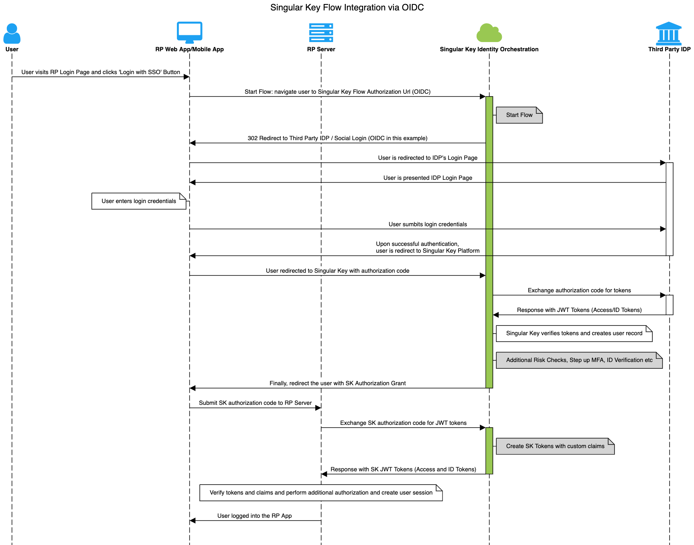

---
sidenav:
---
__TOC__

# Singular Key Flow Integration via OIDC

## Getting Started

There are several ways to invoke a Singular Key Flow - using OIDC (OpenID Connect), SAML 2.0, Web SDK (Widget), Native Mobile SDK or API.

This article documents Flow invocation via OIDC. We will first create a simple flow in Flow Studio in Singular Key Admin Portal.


## Terminology

* **Connector**: A virtual representation of a third party service or a native Singular Key functionality within the Singular Key Orchestration Platform. It exposes a set of **capabilities** that can be used in flows
* **Connection**: A configured instance of a **connector**
* **Flow**: Connections can be connected to each other to create meaningful user journeys or flows

## Creating a Flow
We'll create a Hello World Flow which will Login the user using ZenKey and then create a session with a set of standard claims and redirect the user to the Relying Party redirect Url.

In order to create a ZenKey flow, you will need access to the Singular Key Admin Portal. At a high level, you need to:
* Register an account in the [ZenKey developer portal](https://portal.myzenkey.com/)
* Create and configure **connections**
* Create a **Flow** in Flow Studio 
* Create an **App** and assign a Flow to it. 

We'll walk you through the steps to create your first flow (Helloworld)

### Step 1: Log into Singular Key Admin Portal
Use the Admin Portal URL that is provided to you during the onboarding-process. Login with the credentials provided to you

### Step 2: Create Connection(s)
We'll create a Http Connection (which has the capability to send a JSON response)

* ZenKey Connection
    *  Click on Connections
    *  Click on 'New Connection' button
    *  Choose 'ZenKey' Connector from the dropdown list
    *  Click Create 
        * You should now see a 'ZenKey' connection in your Connections list
    * Now click on the newly created connection and configure its properties. **Note**: You will need to have registered a ZenKey developer account. 

* Next create a 'Singular Key Token Management'/'Singular Key Session' Connection
    *  Click on Connections
    *  Click on 'New Connection' button
    *  Choose 'Singular Key Token Management'/'Singular Key Session' Connector from the dropdown list
    *  Click Create 
You should now see a 'Singular Key Token Management'/'Singular Key Session' connection in your Connections list

### Step 3: Create Flow

* Click on **Flow Studio**
* Click on '**Create New Flow**'
* Enter **Name of Flow** and click 'Create'.
    * A new flow is created and you'll be presented with a Flow Canvas
* On the **Flow Canvas**, click on the + icon on the bottom left corner to '**add connection**'.
* On the Add Connection menu, select the 'ZenKey' Connection. This will automatically place the ZenKey connection on the Flow Canvas.
* Click on the **ZenKey Connection** that is on the canvas. It'll present you with a list of supported capabilities for this connection. 
* Choose the '**ZenKey Login**' capability and click Save.
    * [Optional] In the 'ZenKey Login' capability, you can optionally configure a few parameters like Display Name, CSS etc
* Next, follow up the same steps to create a **'Singular Key Token/Session Management'** node on the canvas. Click on the node and select 'Create Tokens' and hit Save.
* Next,connect the two nodes to each other
* Click on the 'Save' button on the Canvas to **Save and Deploy** the flow


You have **successfully created your first flow** that can be invoked via OIDC!
In the future iterations, we will add several nodes to do various checks like device and location policy checks or MFA Register or Authentication. The idea is that several nodes can be strung together in many different ways to create a complex set of 'if these then those' sequences. 

### Step 4: Create App and Assign Flow to App
* Click on Applications on the left menu
* Click on 'Create New App' button
* Enter app name ('HelloWorld') and click create. You will now see the newly created app in the list
* Select the newly created app. You will be presented a settings dialog box which contains several tabs. 
    * Take a note of the 'CompanyId' and API Key in the General Tab. You will need them to invoke the flow in the later section
* Click on the Flows Tab
    * Select the flow from the 'Add Flow' drop down box
    * Click on Apply 
    * Take note of the FlowId. 
* OIDC Settings are in the OpenId Tab
    * `Client id`
    * `Client secret`
    * `Redirect Url's`: Add your application callback url and hit enter and click Apply
    * `Scopes`: supported Scopes
    * `Grants`: supported Grants

## Invoking a Flow via OIDC
This typically involves
* The customer (Relying Party App) redirects the user to Singular Key Flow ODIC Authorization Url to initiate the flow
* The user is taken through the flow / user journey
* At the end of the flow, Singular Key redirects the user back to the customer's Redirect Uri with the code and state parameters
* The customer backend calls the Singular Key Token Url to exchange the code for the various tokens (`access_token`, `id_token`)

### API Endpoint

SINGULARKEY_API_ENDPOINT

**Sandbox**: https://devapi.singularkey.com
**Production**: https://api.singularkey.com

### OIDC Authorization Url

```bash   
curl GET 'SINGULARKEY_API_ENDPOINT/v1/auth/:companyId/flows/:flowId/authorize?
client_id=CLIENT_ID&
response_type=code&
scope=openid&
redirect_uri=REDIRECT_URI&
state=STATE`
```

#### Request Parameters
* [Required] `:companyId`: Singular Key Generated Unique Id for your account
* [Required] `:flowId`: Singular Key Generated Unique Id for your flow
* [Required] `CLIENT_ID`: client Id can be found in the Singular Key Admin Portal -> Applications->Your App->General Tab 
* [Required]  `REDIRECT_URI`: as defined in the Singular Key Admin Portal -> Applications->Your App->OpenID Tab

### OIDC Token Url

Upon successful execution of the flow, the last node in the flow ('Singular Key Token Management'/'Singular Key Session') will redirect the user to the Relying Party's Redirect Uri (as defined in the Admin Portal -> Applications -> Your App->OpenId Tab) with the `code` and optional `state` parameter. 

Your backend application can call the Token Url to exchange the code for the tokens (`access_token`, `id_token` and `refresh_token`)

```bash   
curl POST 'API_ENDPOINT/v1/auth/:companyId/token' \
--header 'Content-Type: application/json' \
--data-raw '{
  "client_id":"CLIENT_ID",
  "client_secret":"CLIENT_SECRET",
  "grant_type":"authorization_code",
  "code":"CODE"  
}'
```

#### Responses

##### Success Response Fields
* `access_token`: JWT token containing the access token which can be used to fetch user information or access the Singular Key's self service user portal
* `token_type`: Bearer
* `expires_in`: access token's expiry date/time
* `id_token`: JWT token containing ID token related claims. Claims can be customized in the flow by using Singular Key Token Management/Singular Key Session's `Send Custom Claims` capability 

#### JWT Token Validation

`id_token` signature can validated using a node library like node-jose

JWKS public keys is available in the Admin Portal -> Company

##### Example

```json=
const publicKeys = {
    "keys": [
        {
            "kty": "RSA",
            "kid": "-YtA5HbM-d1r8qUGin5P_1W1mGyJCiZObRN6QgnB_Fg",
            "n": "ubObDOrqzsG4LFBjMg-VBc-s39BlfyoB26LT-mKj8vNXjIo0XGXAKTxmieH5tfs3yiXk8X24P7K5KeUG_z1aS7DAHZ2qazVk4IFVdGlM4gXUfirmFsD8Y0Lyo0j8-ecyflqXa13JoZzVuox-P87qJ1jHxu_uodXVdp0JaV9JM6gz08Bus1zrh-IRfyxYgn8dADffJf_a6QFjotwfPgxr2ZmS8J1d-VZWnYJ13GFDzm0yYl4eX9x56TW0lrhnDnhEKy_Q30YLNQomhsRIe6hUYwTieuW82aS-NGK7eFF6fRz2hAhyqnu6PSk5SaZcoFbcVDYX79DBgf_OdgeBkKTTVKMDCAZpYnV6LBX-r_wopxD1da8q_-zaaYXj7p82N4NdqPYbCzSWYKlvlQ1YY64kB_rQsxZF_btXu0Wpv4qPI8j2eSx_JVo2QqtE3b9m3RcaFSuFMs9jTdHt8QaoWpefHj-D6yw4in2E96pLYROuNYP_vW4lwRMbc4A0tPPT7y0GeJq9yK4RITFfuiZUhwBliiN_NGjorJai4OXvXwKaqqLON8Kpo7g6YFmX4ACx_yrNeN-7vDY7D7eFMNhNkCzHCEECghCO6bJFw-3eFYg-gg3NctEIZaTQUrX5Bm3T-w8EQtYsY1BeFVjGC0R81b6f8nPgfNhXozZAfDamQpJTAW0",
            "e": "AQAB",
            "alg": "RS256",
            "use": "sig"
        }
    ]
}

const id_token = 'ID_TOKEN_FROM_TOKEN_URL_RESPONSE'
const jwkResult = await jose.JWK.asKeyStore(publicKeys)
const idToken = await jose.JWS.createVerify(jwkResult).verify(id_token)
const claims = JSON.parse(idToken.payload)

// verify the token expiration
const current_ts = Math.floor(new Date() / 1000)
if (current_ts > claims.exp) {
    throw new Error('ID Token Expired')
}

// verify audience matches client Id
if (claims.aud != clientId) {
    throw new Error('ClientId does not match')
}

```

### User Info Url

User's Access Token from the Token Url Response is used to authenticate to the User Info endpoint

```bash   
curl GET 'API_ENDPOINT/v1/auth/:companyId/user' \
--header 'Authorization: Bearer USER_ACCESS_TOKEN' 
```
##### Response


| Parameter | Description
| -------- | -------- 
| `userId` |  Singular Key assigned unique id to the user
| `username` |  RP assigned username for the user
| `companyId`| Singular Key assigned unique id for the account     
| `connectionId` | connectionId pool to which the user is assigned 
| `createdDate` |  timestamp when the user record was created 
| `authType` | Internal use 
| `name` |  [Optional] name of the user
| `email` | [Optional] user's email address 
| `phoneNumber` |  [Optional] user's phone number 
| `userAlias` |  [Optional] alias assigned to the user
| `mfaEnabled` | [Optional]whether the mfa flag is true or false
| `credentials` |  List of user's credentials 

## Sequence Diagram

The sequence diagram below shows the data flow between the various components when a Flow/User Journey is invoked via OIDC. It uses a Login Flow as an example. The same pattern applies to any other flow type (enrollment, transaction, account recovery) invoked via OIDC.


