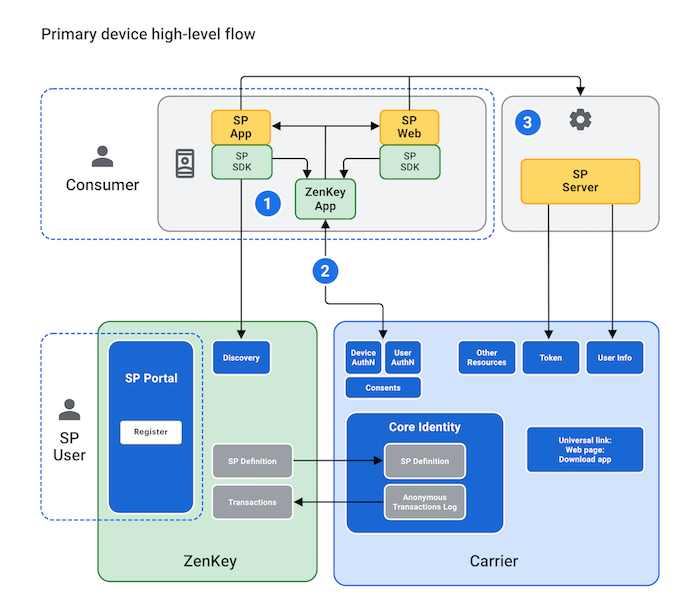
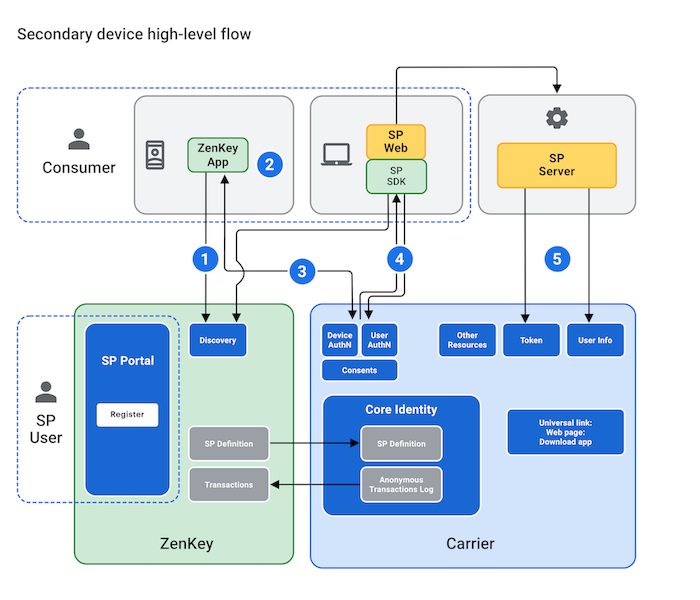

# Authentication flows

Device hardware and cellular carrier networks authenticate users who attempt to access ZenKey Service Provider applications. There are two authentication flows. The primary flow applies to the user's primary mobile device and supports native apps and browser-based websites on the same device as the ZenKey app. Secondary flow applies to other devices that use ZenKey to access a Service Provider app or website.

### Primary Auth Flow

As the following diagram shows, consumers can access your app or website on their primary mobile device.

The flow is from a Service Provider's website, to Service Provider backend, to mobile carrier, to ZenKey and back again.

1. The user's wireless carrier is determined by the SIM card mccmnc — a six-digit number representing the user’s mobile country code (mcc) and mobile network code (mnc) — whose value allows for SIM and user authentication. The carrier returns an authorization code via your Redirect URI.
1. Your app or website makes an authorization code request to the local ZenKey app.
1. If the user consents to share information, your backend server issues a token request for user info and other resources.

### Secondary Auth Flow

The diagram below shows the user on a secondary device, such as a laptop, attempting to access a website.

In this case, ZenKey requires the user to associate the device with the user's primary mobile device. Then the user can authenticate and gain access to your app or website.

As these illustrations show, authentication involves the user’s carrier, your backend service, and the ZenKey platform in the following sequence:

1. The SDK presents the carrier Discovery UI. If the user authorizes a secondary device from an app on a tablet, the SDK uses a web view for this step. Since secondary device flows are not initiated from the user's primary device, if the user has already trusted their browser they may attempt to log in to your app or website from that trusted browser.
1.  If the user has not designated the browser as trusted, the user must scan a visual code or enter the numeric code shown on the secondary device into the ZenKey app on their primary device.
1. When the user approves the request in the ZenKey app on their primary device, the carrier Discovery UI returns a login_hint_token to your app’s Redirect URI. This login_hint_token is only returned to a secondary device for use during the authentication request.
1. To perform SIM and user authentication, your app makes an authorization code request to the appropriate carrier and receives the auth code in its Redirect URI.
1. If the user consents to share information, your backend server issues a token request for user info and other resources.