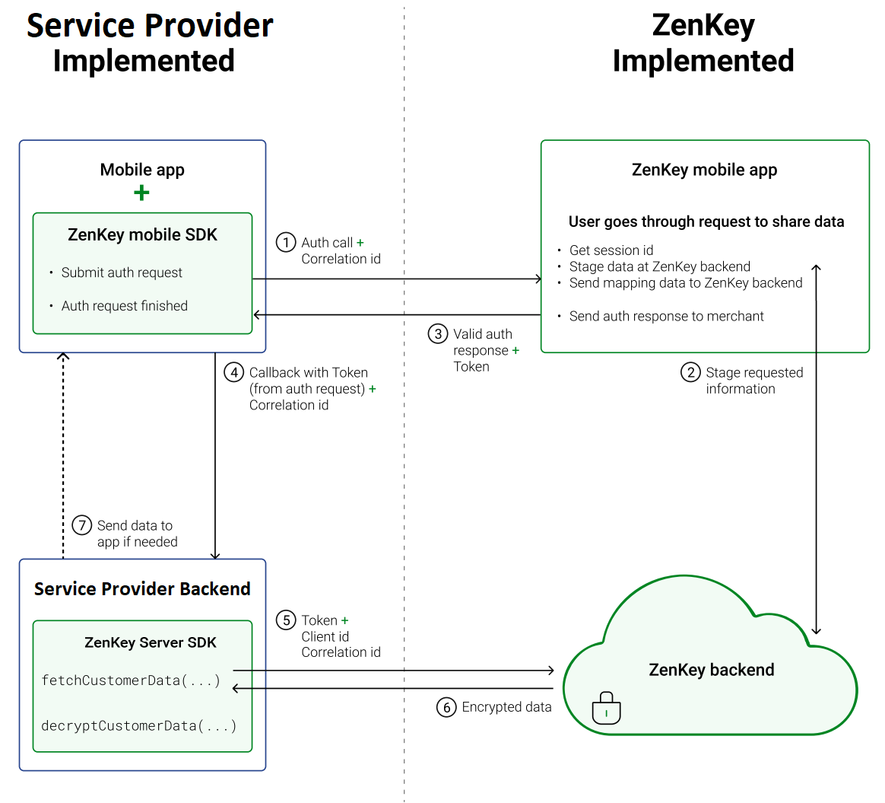

# Technical overview

The following diagram shows basic application logic between service provider, ZenKey, and the mobile network carrier.

1. The Service Provider integrated Mobile App uses the ZenKey mobile SDK to call the ZenKey Mobile App, passing information needed for authentication
2. The ZenKey Mobile App passes the user's data to the ZenKey backend for authentication and receives an authentication token.
3. The ZenKey Mobile App responds to the integrated mobile app's request in 1 with the authentication token.
4. The integrated app passes the token and other information to the Service Provider backend.
5. The Service Provider backend contacts the ZenKey backend, giving the authentication token and requesting authorization for the needed data.
6. The ZenKey backend validates the token, then responds with an authorization token for the encrypted data.
7. If needed, the Service Provider backend sends data to the integrated mobile app on the user device.