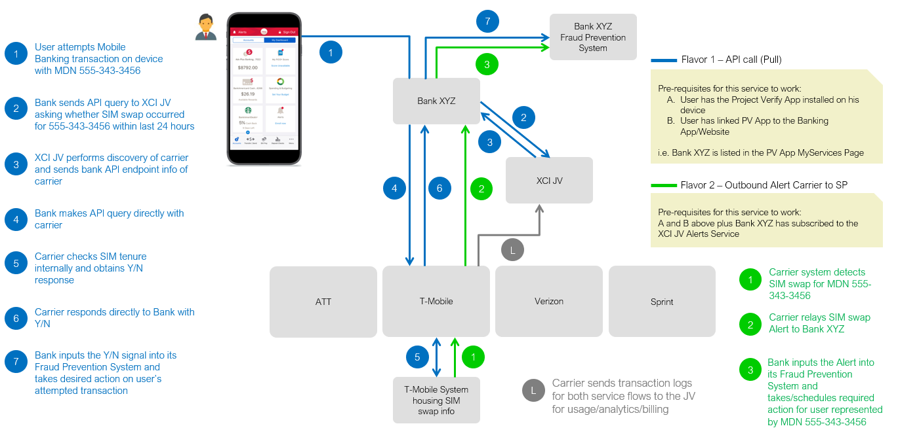

# Workflow options
Service Providers can use one or both workflows to implement trust service endpoints: 

1. Query a user's SIM tenure indicator 
2. Automatically receive alerts about a triggered event indicating that the user's mobile device has changed

The Service Provider selects options that match its fraud prevention objectives.

## 
The following diagram illustrates the service flows for these two options (blue for API call; green for event alert).

