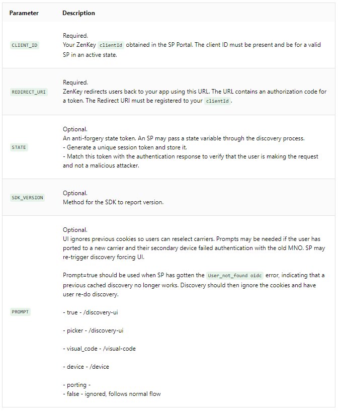
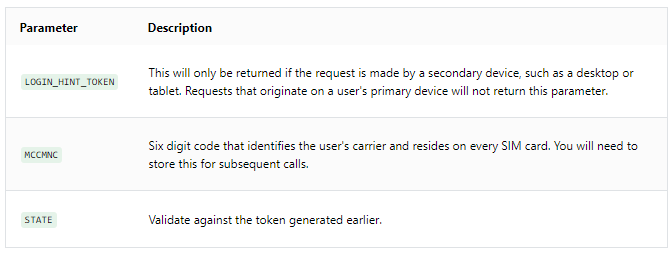

# Implement the Authentication Flow on the Web

The web and server implementation supports authorization on both primary and secondary devices.

For implementation on a website, the authentication flow begins with a carrier Discovery UI. After pressing the ZenKey button on your site, users navigate to a web page containing a visual and numeric code linking the web request to the ZenKey application on their primary device. 

When supporting iOS and Android implementations, the SDK handles carrier Discovery UI. This step is either skipped, because the app is on the user's primary device, or automatically invoked.

## The Carrier Discovery UI

**Note:** This section and its subsections are handled by the iOS or Android SDK within your application on a user's primary device.

The carrier Discovery UI web page presents users with a visual and numeric code. Users receive a prompt to open the ZenKey application on their primary device to authorize the request. If using a device with a SIM card installed, prompts ask them to choose their carrier before proceeding to the ZenKey app through the visual code flow outlined above.

The first time users navigate this step on a device, they create a link between the browser and their ZenKey account known as a 'trusted browser'. On subsequent authentication requests, users bypass the visual and numeric code flow. Instead, their primary devices receive push notifications creating a seamless approval.

ZenKey handles the logic associated with these two carrier Discovery UI experiences.

## The Redirect User-Agent

The carrier's `DISCOVERY_UI` endpoint brings users to ZenKey's carrier discovery UI and a visual code or the option to select their carrier's logo.

```
https://discoveryui.myzenkey.com/ui/discovery-ui?
	client_id=CLIENT_ID
	&redirect_uri=REDIRECT_URI
	&state=STATE
	&sdk_version=SDK_VERSION
	&prompt=true
```



## The Response

The user redirects to your `REDIRECT_URI`, whose URL also contains the parameters `LOGIN_HINT_TOKEN`, `MCCMNC` and `STATE`. For example:

```
https://server.example.com/cb?login_hint_token=<xxx>&mccmnc=<xx>&state=<state>
```

Us the `LOGIN_HINT_TOKEN` for the authorization code request (see [requesting authorization code on the web](doc:web-requesting-authorization-code)); the `MCCMNC` during the OIDC Discovery request; and `STATE` for validating whether its returned value matches the one sent in the request.

