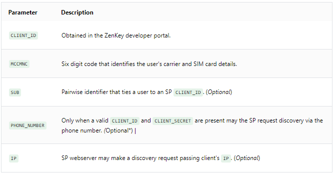

# Obtain the Carrier OpenID Configuration

The iOS or Android SDK within your application on a primary device handle this section and its subsections."

Perform OIDC Discovery to fetch the OpenID configuration document for the user's carrier. This call provides information about the carrier's OpenID configuration including all necessary endpoints and public key location information. Use `https://discoveryissuer.myzenkey.com/.well-known/openid_configuration` as the  `DISCOVERY_URL` variable in your implementation. 

## The Request

For discovery requests made only with a `PHONE_NUMBER`, you may use the "proof of possession" signature `Header: x-authorization`.