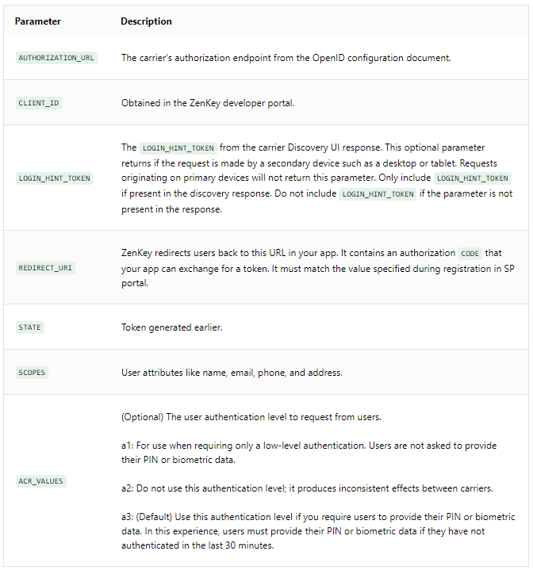
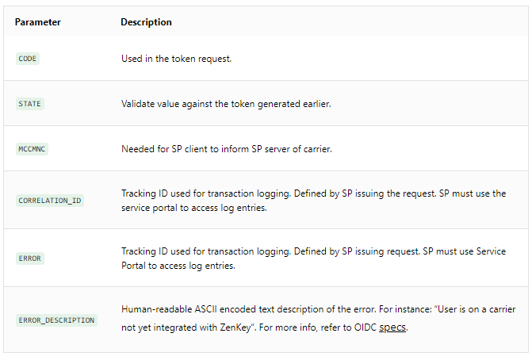

# Requesting Authorization Code on the Web

This section and its subsections are handled by the iOS or Android SDK within your application on a user's primary device.

When you request an authorization code, the request will be to the carrier's `AUTHORIZATION_ENDPOINT` returned in the discovery response. The `REDIRECT_URI` created when you retrieved your `CLIENT_ID` and `CLIENT_SECRET` in the [ZenKey Developer Portal](https://portal.myzenkey.com/login) are also included as well as several other parameters listed below. Note that `LOGIN_HINT_TOKEN` is optional and should only be included when present in the discovery response. 
 
```
https://AUTHORIZATION_URL?
	client_id=CLIENT_ID
	&login_hint_token=LOGIN_HINT_TOKEN
	&redirect_uri=REDIRECT_URI
	&response_type=code
	&scope=SCOPES
	&state=STATE
```



### The Authorization Response

The user-agent redirects to the specified `REDIRECT_URI` with these URL parameters.

